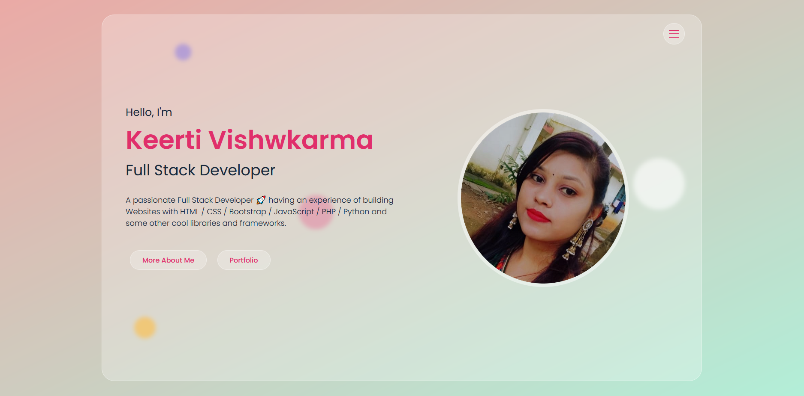

# Personal Portfolio Website

This repository contains the source code and files for my personal portfolio website. Responsive Portfolio Website Design Using HTML CSS & JavaScript. Give it a star 🌟 if you find it useful.

## Description

The personal portfolio website showcases my skills, projects, and experiences as a web developer. It serves as an online platform to highlight my work and provide information about my background and expertise.
Created with HTML, CSS, and JavaScript. Get inspired and connect with me!"

## Features

- Home :- Introduces myself and provides a brief overview of my skills and interests.
- About :- Details my professional background, education, and experience.
- Skills :- Lists the programming languages, frameworks, and tools I am proficient in.
- Projects :- Showcases the projects I have worked on, including descriptions, screenshots, and links to live demos or repositories.
- Contact :- Offers various ways to get in touch with me, such as through email, social media, or a contact form.

## Technologies Used

- HTML :- Markup language used for structuring the website.
- CSS :- Stylesheet language used for designing and formatting the website.
- JavaScript :- Programming language used for adding interactivity and dynamic features.

## Getting Started

To view the website locally or make modifications, follow these steps:

1. Clone the repository: `git clone [https://github.com/keerti1924/Personal-Portfolio-Website.git]`
2. Open the project folder in your preferred code editor.
3. Open the `index.html` file in a web browser to view the website.

## Contributing

I appreciate any suggestions, feedback, or contributions to enhance this personal portfolio website.

## Contact

If you have any questions or inquiries, please feel free to reach out to me through the contact information provided in the website or by using the contact form.

Thank you for visiting my personal portfolio repository! I hope you find it informative and visually appealing. Give it a star 🌟 if you find it useful.

